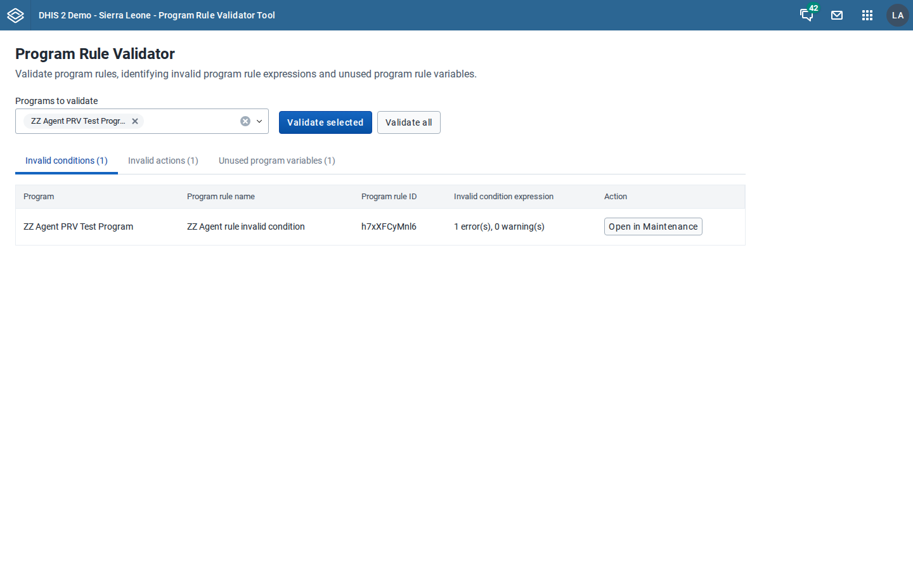
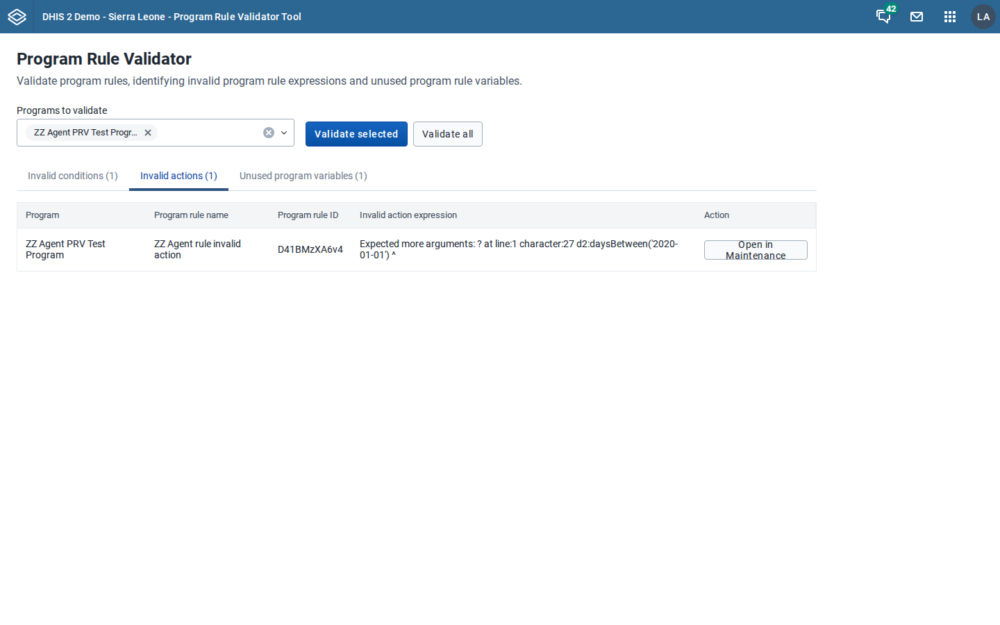
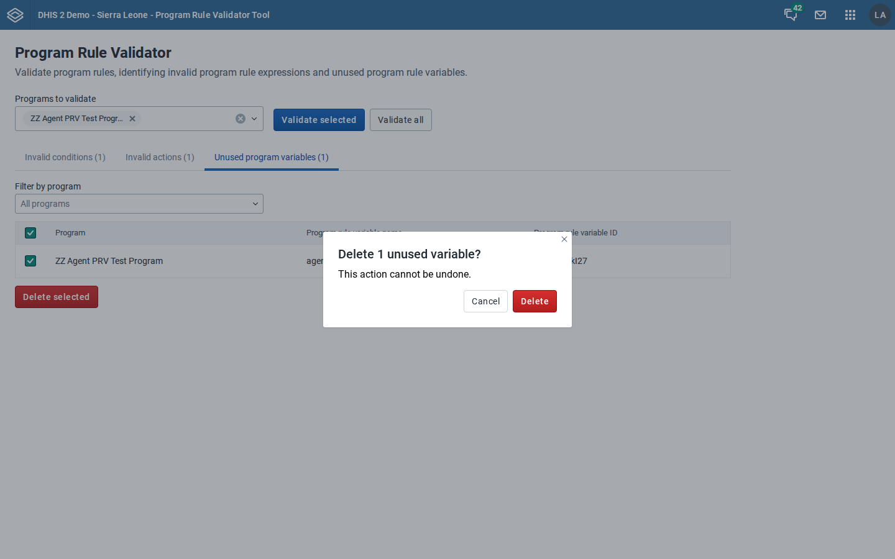

# UI test results: Program Rule Validator (App Platform migration)

Tested: 2026-07-11 · Method: production bundle (`build/bundle/tool-pr-validator-1.0.0.zip`) installed via `POST /api/apps`, driven with Playwright (frame-aware for the 2.42+ global shell) · Auth: `local_admin` session cookie.

Test data: a throwaway program (`ZZ Agent PRV Test Program`) seeded per run with one rule with an invalid condition (unknown-variable reference), one rule with an invalid action data expression (`d2:daysBetween` missing an argument), one valid rule referencing PRV `agent_used_var`, plus one used and one unused PRV. Seeded and cleaned up by `tests/e2e/fixtures.py`.

## Instances

| Label | URL | DHIS2 version | Database | Source |
|---|---|---|---|---|
| 2.40 | dhis2-agent-prv-sl40 | 2.40.12 | Sierra Leone demo v40 | broker |
| 2.41 | dhis2-agent-laos-hmis | 2.41.9 | Laos HMIS demo | broker (pre-existing) |
| 2.42 | dhis2-agent-prv-sl42 | 2.42.x | Sierra Leone demo v42 | broker |
| 2.43 | dhis2-agent-prv-sl43 | 2.43.x | Sierra Leone demo v43 | broker |

The task asked for coverage of both the Laos and Sierra Leone databases and at least one test per version 2.40–2.43. Laos supplied the 2.41 run; Sierra Leone supplied 2.40, 2.42 and 2.43.

## Results

| Step | 2.40 (SL) | 2.41 (Laos) | 2.42 (SL) | 2.43 (SL) | Notes |
|---|---|---|---|---|---|
| App loads | PASS | PASS | PASS (iframe) | PASS (iframe) | 2.42+ serves the app inside the global-shell iframe; test located the app frame correctly. |
| Program dropdown populated | PASS (15) | PASS (29) | PASS (15) | PASS (15) | counts include the seeded program. |
| Validate-selected disabled with no selection | PASS | PASS | PASS | PASS | |
| Validation run completes | PASS | PASS | PASS | PASS | seeded program only. |
| Invalid condition detected | PASS | PASS | PASS | PASS | seeded rule listed in Invalid conditions tab. |
| Invalid action expression detected | PASS | PASS | PASS | PASS | descriptive server message shown ("Expected more arguments…"). |
| Unused variable detected; used variable absent | PASS | PASS | PASS | PASS | 1 unused row, 0 used rows. |
| Delete unused variable via UI (confirm modal) | PASS | PASS | PASS | PASS | success AlertBar "Deleted 1 variable."; row removed. |
| Deletion verified via API (404) | PASS | PASS | PASS | PASS | PRV GET → 404 afterwards. |
| Cancel a validate-all run | PASS | PASS | PASS | PASS | "Validation cancelled" notice shown. |
| No unexpected HTTP errors | PASS | PASS | PASS | PASS | see hygiene note. |
| No console/page errors | PASS | PASS | PASS | PASS | see hygiene note. |

The "Open in Maintenance" deep link (`dhis-web-maintenance/index.html#/edit/programSection/programRule/{id}`) was checked separately: the path resolves (HTTP 302 → the app, not 404) on both 2.41 and 2.43, so the button targets a live app across the tested range.

## Version-specific failures

None. Every step passed on every version. The only version-dependent behaviour is expected and handled: on 2.42+ the app is served inside the global-shell iframe, and the app's `SyncUrlWithGlobalShell` popstate handling plus frame-safe `window` usage work correctly there.

## Console/network hygiene

All "errors" observed during passing runs are benign and not from the app's own code:

- **`404 …/staticContent/logo_banner`** — the DHIS2 header bar (supplied by the App Platform shell) probes for a custom instance logo; the demo instances have none. Shell-level, universal.
- **`409 …/expression/description`** — DHIS2 returns HTTP 409 (body `status:ERROR`) for an invalid *action* expression; the app reads the body and renders a result row. Expected server behaviour, correctly handled. (The *condition* endpoint returns 200 with `status:ERROR` for the same situation — a server inconsistency the app tolerates.)
- **"This window is not a secure context — PWA features will not work"** — emitted by the shell service-worker probe because tests run over plain HTTP; production is HTTPS.

After filtering these, zero app-originated console errors, page errors, or unexpected HTTP responses on any version.

## Screenshots (2.40, Sierra Leone)

Per-version screenshots for every step are under `screenshots/<label>-*.png`.
